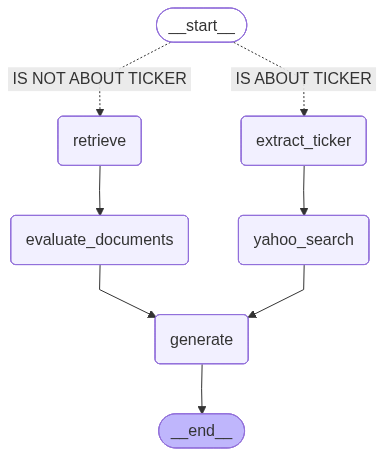

# Agentic RAG Demo

An experimental system that combines **Retrieval-Augmented Generation (RAG)** with **agentic decision-making**.  
It answers questions about a local dataset, and can also query Yahoo Finance for real-time commodity and index prices.  

The system is built with:

- **LangGraph** → to orchestrate agent flow
- **FastAPI** → RESTful backend
- **FAISS** → local vector store for document retrieval
- **yfinance** → live financial data
- **HTML/CSS/JS frontend** → simple chat UI (WhatsApp-style)

---

## LangGraph Workflow



**Flow Explanation:**

1. **Start** → `query_evaluate` node  
   - Decide whether the question is about a ticker price.  
2. If **finance query** →  
   - `extract_ticker` → `yahoo_search` → `generate`  
3. If **knowledge query** →  
   - `retrieve` → `evaluate_documents` → `generate`  
4. End → returns answer

---

## Features

- Retrieval from local JSON dataset of geopolitical/supply chain events  
- Yahoo Finance price lookup for futures, indices, ETFs, large-cap stocks  
- LangGraph workflow to decide:  
  - “Is this a finance query?” → extract ticker + query Yahoo Finance  
  - “Or a knowledge query?” → retrieve documents → generate answer  
- Frontend chat window for interaction, with **typing animation** to signal inference  

---

## Project Structure

```text
AGENTIC-RAG-DEMO/
├─ agent/
│  └─ app/
│     ├─ graph/                 # LangGraph wiring
│     │  ├─ build.py            # builds/compiles the workflow
│     │  └─ graph_chain.py      # shared graph/state helpers
│     ├─ nodes/                 # node functions (RAG + finance path)
│     │  ├─ evaluate_documents.py
│     │  ├─ evaluate_query.py
│     │  ├─ extract_state.py
│     │  ├─ generate.py
│     │  ├─ retrieve.py
│     │  └─ yahoo_finance_state.py
│     ├─ services/              # LLM services (structured outputs, routers, etc.)
│     ├─ tools/                 # utilities/clients
│     │  ├─ embed_texts.py      # OpenAI embedding wrapper
│     │  └─ yahoo_finance_api.py# yfinance wrapper
│     ├─ static/
│     │  └─ index.html          # chat UI (served by FastAPI)
│     ├─ main.py                # local runner for the graph
│     └─ server.py              # FastAPI app (/, /chat)
├─ data/
│  ├─ local.json                # source events
│  └─ vector_store/             # FAISS artifacts
│     ├─ ****.faiss
│     └─ ***_fused.json
├─ workflow_graph.png           # LangGraph diagram
├─ scripts/
│   ├─ build_knowledge_base.py  # build vector store
├─ .env.example
├─ .gitignore
├─ requirements.txt
└─ README.md
```

---

## Running the Project

### 1. Install dependencies
```bash
pip install -r requirements.txt
````

### 2. Set environment variables

Create a .env file in the project root:
```
OPENAI_API_KEY=sk-xxxx...
QUERY_EXTRACTOR_MODEL=gpt-5
QUERY_EVAL_MODEL=gpt-5
```

### 3. Start the backend
```
uvicorn agent.app.server:app --reload
```

### 4. Open frontend

Visit http://localhost:8000 in your browser.
Use the chat box to ask questions like:
- “What is the tariff situation between the US and the EU?”
- “What is the price of gold yesterday?”


### Next Steps

- Stream answers token-by-token for smoother UX
- Deploy to cloud (e.g., GCP or AWS) with managed FAISS store
- Expand Yahoo Finance tool with more robust ticker recognition
- Expand the graph nodes/edges for more types of questions

### License 
MIT
